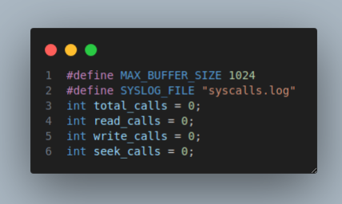
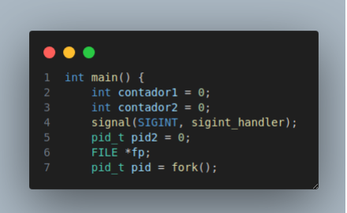
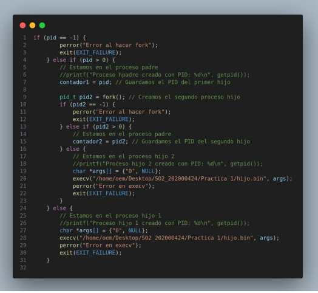

# Manual Tecnico
## Jonatan Leonel Garcia Arana
## Introduccion 
El presente documento describe la practica destinada a comprender el funcionamiento de las
llamadas al sistema en el contexto del sistema operativo Linux MINT. Se abordarán temas
relacionados con la gestión de procesos, así como la capacidad de interceptar estas llamadas
para monitorear y registrar su actividad.
El objetivo principal es desarrollar un programa en lenguaje C que actúe como proceso padre y
cree dos procesos hijos. Estos procesos hijos realizarán operaciones de manejo de archivos
sobre un archivo específico, mientras que el proceso padre interceptará y registrará las llamadas
al sistema realizadas por los hijos.
#
## Requerimientos minimos
#
## Requerimientos para Linux Mint:
- Sistema operativo: Linux Mint (versión específica, por ejemplo, Linux Mint 20.3 "Una").
- Procesador: Procesador compatible con arquitectura de 32 bits (x86) o 64 bits (x64)
- Memoria RAM: Se recomienda al menos 1 GB de RAM para compilaciones simples y
desarrollo básico en C. Para proyectos más complejos, se recomiendan 2 GB o más.
- Espacio en disco: Se recomienda un mínimo de 16 GB de espacio disponible en disco
- Herramientas de desarrollo: Compilador de C compatible con Linux Mint (se puede
instalar GCC, por ejemplo)
# 
## Instalación y Configuración de Herramientas de Desarrollo:
- Compilador GCC: El compilador GCC generalmente viene preinstalado en la mayoría de
las distribuciones de Linux, incluyendo Linux Mint. Si no está instalado, puede instalarlo
a través del gestor de paquetes de su distribución con el siguiente comando:
sudo apt-get install build-essential
- Editor de texto o IDE: Puede utilizar cualquier editor de texto de su preferencia, como
Vim, Emacs, o instalar un IDE como NetBeans, Code::Blocks, o Visual Studio Code
#
## INICIANDO EJECUCION DEL PROGRAMA
#
Para esta practica estaremos utilizando 3 archivos los cuales son los siguientes:
- Padre.c: se encargara de la creacion de los procesos hijos y de la llamada a systemtrap
- Hijo.c: tendra la logica necesaria para simular los procesos para cuando el padre mande a llamar a los hijos
- Trace.stp: archivo de systemtrap, en el cual estaremos monitereando todas las llamdas a los procesos hijos(Read,Write,Seek)
### Archivo Padre:
#### librerias utilizadas 
- stdio.h
- stdlib.h
- unistd.h
- syst/wait.h
- string.h
- signal.h
#### Variables
#
 

### INICIO DEL CODIGO
En esta parte creamos unos contadores, los cuales nos ayudaran a llevar el control delos PID y asimismo declaramos el metodo signal, el cual nos ayuda a capturar el ctrl + C, mas adelante explicaremos que hace cuando se hace esto.
 

Luego declaramos el primer fork, que es el primero que estaremos utilizando en el programa
 

#
Area de trabajo de Administracion y Configuracion IP
 

#
Area de trabajo de Recursos y Configuracion IP
 

#
Area de trabajo de Atencion al Cliente y Configuracion IP
 

#
# COMUNICACION ENTRE AREAS
Comunicacion desde Atencion al cliente a oficina B e IP de la oficina B
 

#
Comunicacion desde Oficina A a recursos humanos e IP de recursos
 

#
Comunicacion desde Gerencia a oficina C e IP de la oficina C
 

# Captura de paquete ARP
ip a donde mandamos el paquete
 

 

 

#

# Conclusion
La realización de esta práctica nos permitio demostrar la capacidad para diseñar y configurar una red local pequeña utilizando la herramienta Packet Tracer. Al finalizar la práctica, hemos adquirido experiencia en la creación de topologías de red en estrella, la configuración de switches, la asignación de direcciones IP y la realización de capturas de paquetes para verificar la conectividad entre los dispositivos.

