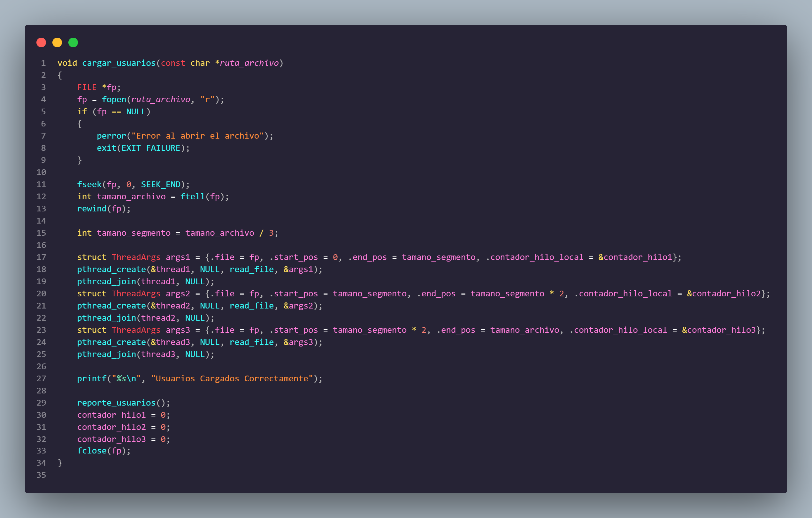
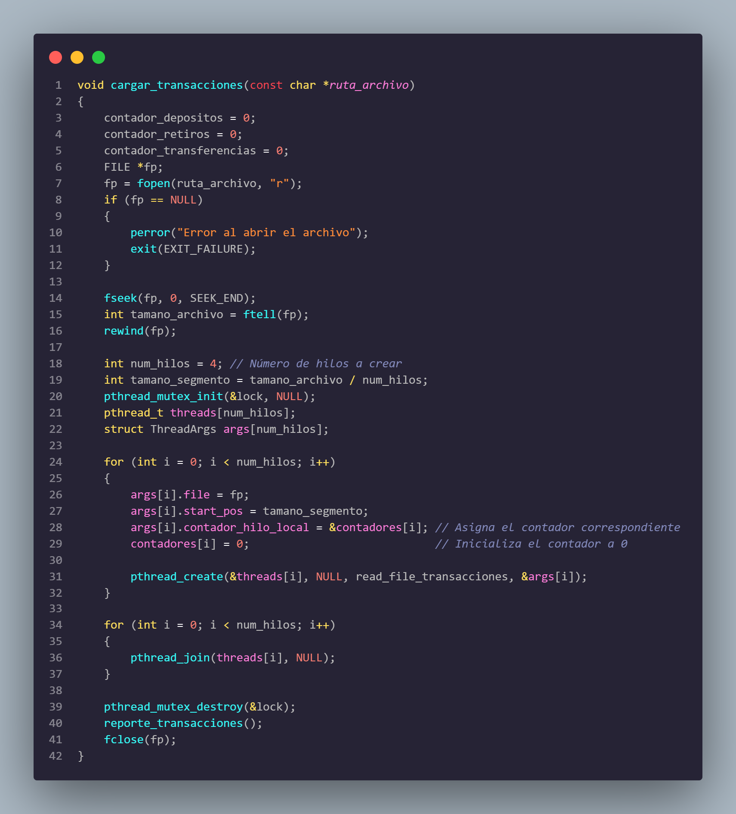
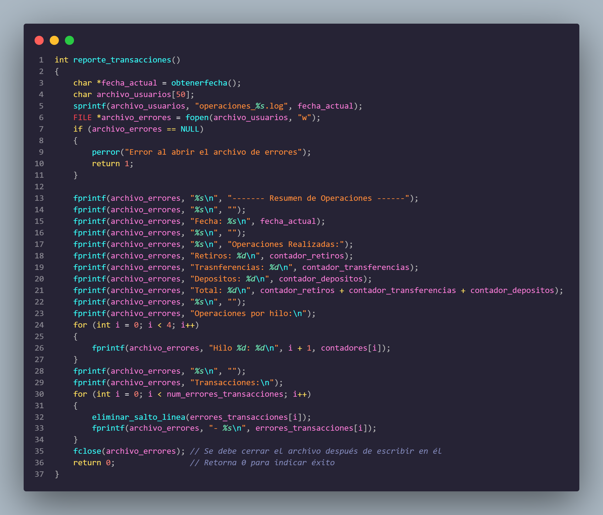
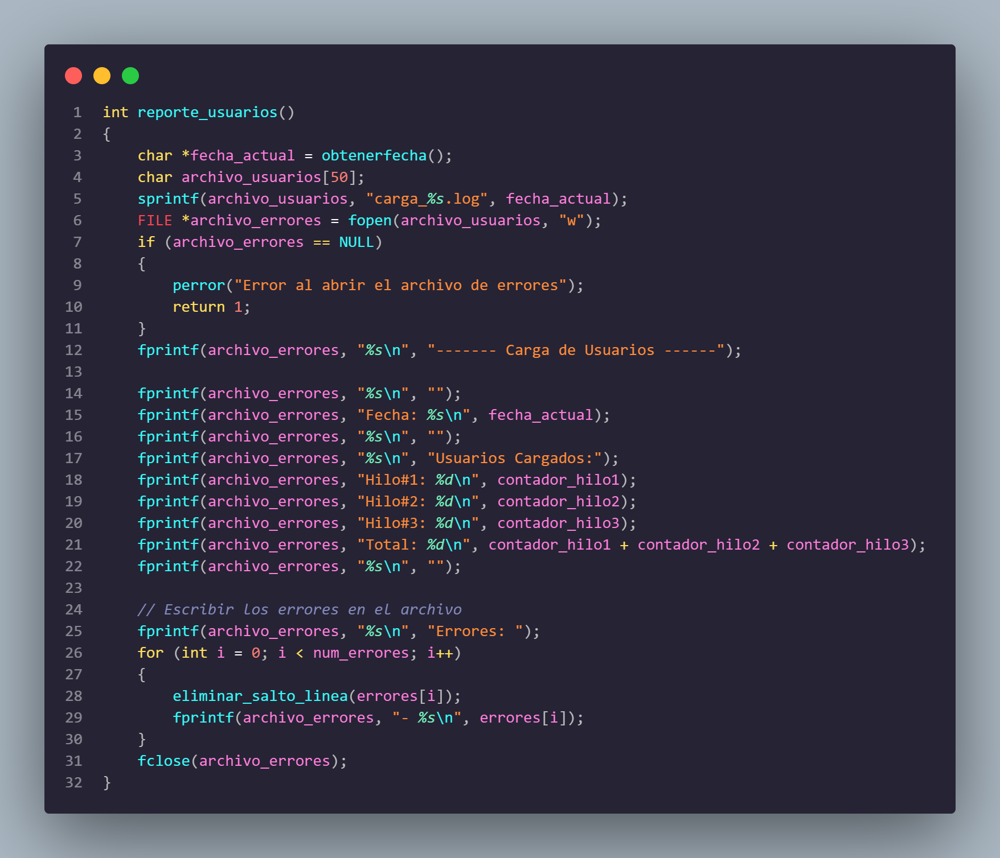
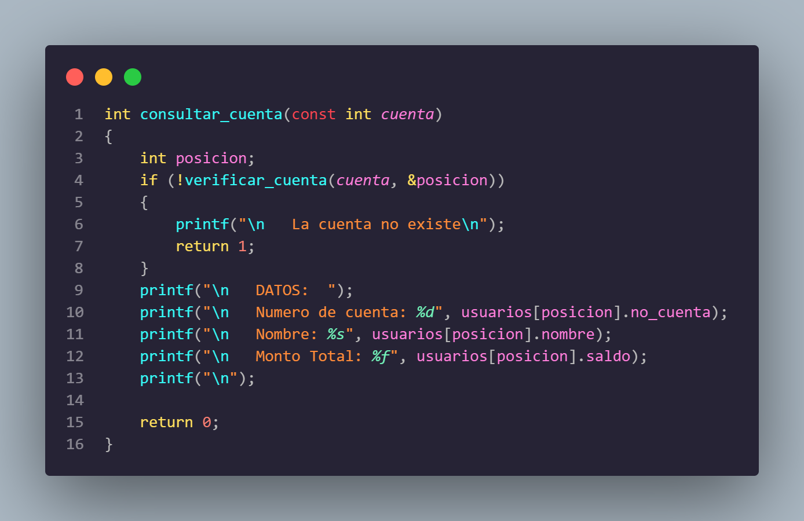
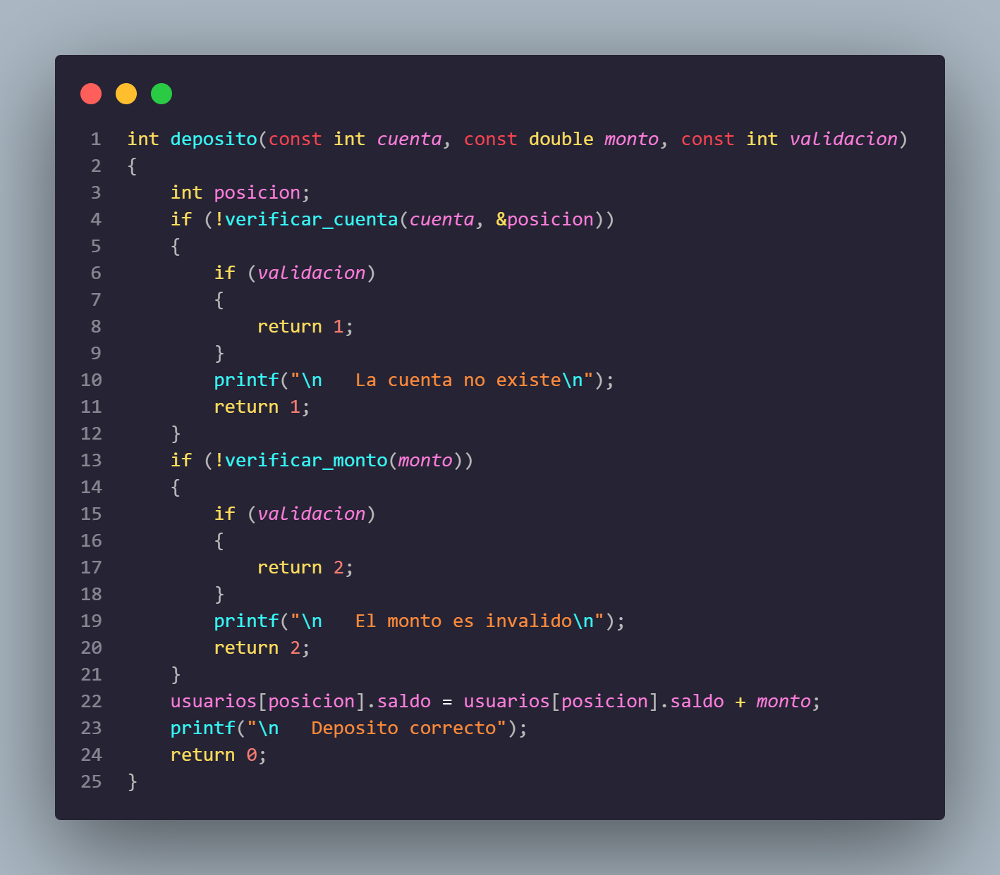
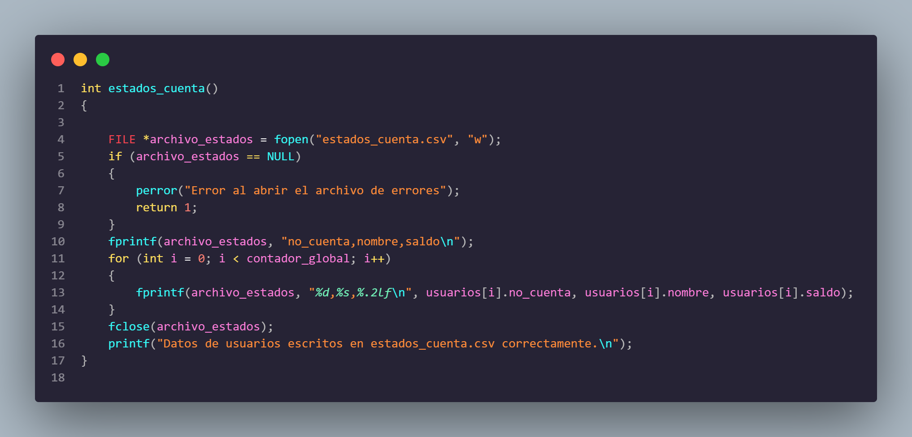
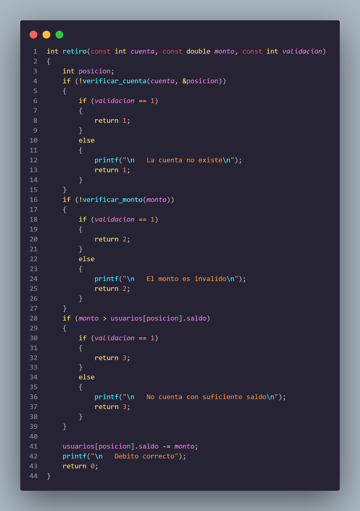
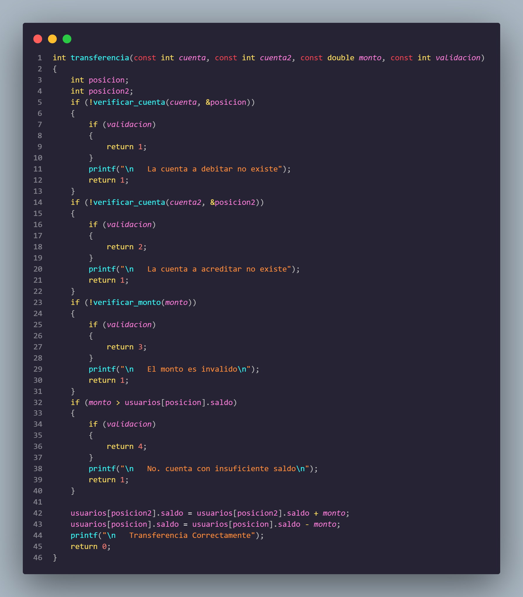

# Manual Tecnico
## Jonatan Leonel Garcia Arana
## Introduccion 
El presente manual técnico proporciona una guía detallada sobre el desarrollo e implementación de una aplicación en consola en el lenguaje de programación C para el manejo de datos de usuarios y operaciones monetarias en un entorno bancario. Este sistema está diseñado para proporcionar una carga masiva de usuarios y operaciones, así como realizar operaciones individuales y generar reportes sobre el estado de cuentas y las actividades realizadas.
#
## Requerimientos minimos
#
## Requerimientos para Linux Mint:
- Sistema operativo: Linux Mint (versión específica, por ejemplo, Linux Mint 20.3 "Una").
- Procesador: Procesador compatible con arquitectura de 32 bits (x86) o 64 bits (x64)
- Memoria RAM: Se recomienda al menos 1 GB de RAM para compilaciones simples y
desarrollo básico en C. Para proyectos más complejos, se recomiendan 2 GB o más.
- Espacio en disco: Se recomienda un mínimo de 16 GB de espacio disponible en disco
- Herramientas de desarrollo: Compilador de C compatible con Linux Mint (se puede
instalar GCC, por ejemplo)
# 
## Instalación y Configuración de Herramientas de Desarrollo:
- Compilador GCC: El compilador GCC generalmente viene preinstalado en la mayoría de
las distribuciones de Linux, incluyendo Linux Mint. Si no está instalado, puede instalarlo
a través del gestor de paquetes de su distribución con el siguiente comando:
sudo apt-get install build-essential
- Editor de texto o IDE: Puede utilizar cualquier editor de texto de su preferencia, como
Vim, Emacs, o instalar un IDE como NetBeans, Code::Blocks, o Visual Studio Code
#
## INICIANDO EJECUCION DEL PROGRAMA
#
Para esta practica estaremos alojando todo en el archivo main.c, el cual contendra toda la logica y la creacion de hilos y la implementacion de mutex.
### Archivo Main:
#### librerias utilizadas 
- stdio.h
- stdlib.h
- unistd.h
- syst/wait.h
- string.h
- signal.h
- time.h
- ctype.h

### INICIO DEL CODIGO

En la funcion main tendremos nuestro menu, el cual lo estaremos trabajando con un switch y sus distintas opciones, aqui mandaremos a llamar los metodos que sean necesarios y que se explicaran mas adelante
 

 

### Carga de Usuarios
para la carga de usuarios, estaremos utilizando 3 hilos, los cuales se distribuyen equitativamente por el tamaño del archivo, asi de esa manera cada hilo contara con un porcentaje para leer del archivo
 

### Carga Transacciones: 
Para la carga de transacciones utilizaremos un hilo mas y en esta parte estaremos utilizando mutex, esto nos ayudara a manejar de mejora manera las transacciones que vienen, para que se lleve un mejor flujo de trabajo
 

#
### Reporte Transacciones:
Metodo que se encarga de crear el archivo de reportes, aqui se llevara el control de todas las transacciones que se hicieron durante su ejecucion.
 

#
### Reporte Usuarios:
Metodo que genera el archivo de reportes de usuario, aqui se mostrara cuantos usuarios cargo cada hilo y los errores
 

#
### Consultar Cuenta:
Metodo que se encarga de retornar datos sobre la cuenta que se envia, verifica si la cuenta es existente dentro del sistema y si es correcto devuelve sus datos
 

#
### Deposito
Metodo que se manda a llamar desde el switch, se encarga de manejar la logica para hacer un deposito, verifica si existe la cuenta y si el monto es valido, luego agregar el valor a la posicion que se obtuvo
 

#
### Generar Estados De cuenta
Metodo que crea un archivo .csv, el cual tiene toda la informacion de los usuarios
 

 
### Retiro
Metodo que se encarga de la logica para hacer un retiro, el cual verifica si existe la cuenta y de igual manera verifica si el monto es correcto y al ser un retiro se tiene que verificar que el saldo sea mayor al debito p.

 

 
### Transferencia
Metodo que se encarga de realizar una transferencia, en este metodo tenemos que verificar ambas cuentas que vienen, si no existen retornarmos un error y de igual manera tenemos que verificar que la cuenta a debitar tenga saldo suficiente.
 

