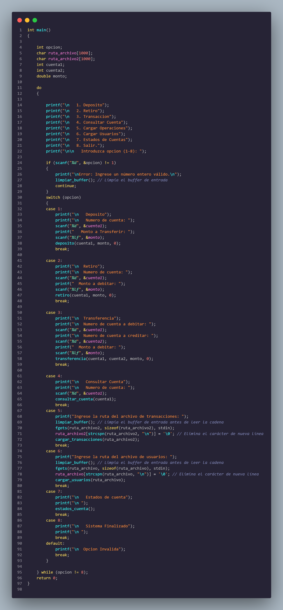

# Manual Tecnico
## Jonatan Leonel Garcia Arana
## Introduccion 
El presente manual técnico proporciona una guía detallada sobre el desarrollo e implementación de una aplicación en consola en el lenguaje de programación C para el manejo de datos de usuarios y operaciones monetarias en un entorno bancario. Este sistema está diseñado para proporcionar una carga masiva de usuarios y operaciones, así como realizar operaciones individuales y generar reportes sobre el estado de cuentas y las actividades realizadas.
#
## Requerimientos minimos
#
## Requerimientos para Linux Mint:
- Sistema operativo: Linux Mint (versión específica, por ejemplo, Linux Mint 20.3 "Una").
- Procesador: Procesador compatible con arquitectura de 32 bits (x86) o 64 bits (x64)
- Memoria RAM: Se recomienda al menos 1 GB de RAM para compilaciones simples y
desarrollo básico en C. Para proyectos más complejos, se recomiendan 2 GB o más.
- Espacio en disco: Se recomienda un mínimo de 16 GB de espacio disponible en disco
- Herramientas de desarrollo: Compilador de C compatible con Linux Mint (se puede
instalar GCC, por ejemplo)
# 
## Instalación y Configuración de Herramientas de Desarrollo:
- Compilador GCC: El compilador GCC generalmente viene preinstalado en la mayoría de
las distribuciones de Linux, incluyendo Linux Mint. Si no está instalado, puede instalarlo
a través del gestor de paquetes de su distribución con el siguiente comando:
sudo apt-get install build-essential
- Editor de texto o IDE: Puede utilizar cualquier editor de texto de su preferencia, como
Vim, Emacs, o instalar un IDE como NetBeans, Code::Blocks, o Visual Studio Code
#
## INICIANDO EJECUCION DEL PROGRAMA
#
Para esta practica estaremos alojando todo en el archivo main.c, el cual contendra toda la logica y la creacion de hilos y la implementacion de mutex.
### Archivo Main:
#### librerias utilizadas 
- stdio.h
- stdlib.h
- unistd.h
- syst/wait.h
- string.h
- signal.h
- time.h
- ctype.h

### INICIO DEL CODIGO

En la funcion main tendremos nuestro menu, el cual lo estaremos trabajando con un switch y sus distintas opciones, aqui mandaremos a llamar los metodos que sean necesarios y que se explicaran mas adelante
 

 
Luego declaramos el primer fork, que es el primero que estaremos utilizando en el programa
 

en esta parte del codigo, tendremos la logica para ejecutar nuestro procesos hijos, el cual si entra al primer if que iguala a -1, este es un error, luego sabemos que si el PID que viene es mayor a 0 es el proceso padre, encontes cuando entra a este else if, creamos el segundo proceso hijo y siguiendo la misma logica para el primer hijo pues verificamos si el PID2 que viene es padre o hijo y si no es mayor a 0 es el proceso hijo, entonces en el else del proceso hijo, mandamos a ejecutar el archivo hijo.bin, esto lo hacemos con execv. 
ambos hijos llaman al mismo archivo, ya que esatermos simulando el mismo proceso
#
### llamada a archivo systemtrap
para la llamada de este archivo tenemos un char de 100 caracteres, el cual utilizaremos para almacenar el comando, luego con ayuda de un snprintf, que guarda el comando, el cual seria sudo stap trace.stp, el cual va redirigir toda su salida al archivo syscall.log. Este archivo trace.stp va recibir dos parametros, el cual es el pid del hijo 1 en este caso contador1 y el pid del hijo 2 en este caso contador 2, con el system(command) mandamos a ejecutar el systemrap y luego con un waitpid esperamos a que terminen los procesos hijos.
 

### Método hijo que escribe en el archivo: 
en esta parte, tenemos un metodo llamdo hijo_escribir, el cual recibe el file, que seria el open del archivo practica1.txt, se crea un char de 8 caracteres y con un for, el cual tiene un random, ingresa a escribir números o a escribir letras, luego con un write escribimos en el archivo
Area de trabajo de Recursos y Configuracion IP
 

#
### Metodo hijo que lee archivo:
En este metodo tenemos un char el cual nos ayuda a leer las 8 posiciones del archivo, esto donde se encuentre el apuntador.
 

#
### Metodo seek, que redirecciona a la primera posicion:
Con un lseek podemos redireccionar a cualquier lugar del archivo el apuntador, en este caso lo redireccionamos a la posicion 0
 

#
### Metodo que captura la señal ctrl + C:
En esta parte del codigo tendermos la logica para obtener el conteo de los procesos que se hicieron, para esto utilizamos un fopen, el cual abre el archivo syscall.logs y recorremos el archivo con un while, en el cual si encuentra la palabra read, write o seek, suma la variable dependiendo la condicion encontrada, con una serie de pasos simples, obtenemos el conteo toal y ya imprimimos en consola nuestros procesos totales.
 

#
### Funcion main del archivo hijo
En esta funcion, creamos el archivo practica1.txt en el cual se hace los procesos de escribir, leer y redireccionar el puntero, entonces con un while hacemos que se repita el c´digo, luego con un random de 1 a 3, ponemos un sleep para que espere un tiempo aleatorio y con un switch y un random, elije que funcion manda a llamar, que en este caso seria hijo_escribir, hijo_leer e hijo_seek, esto se repitira hasta que se termine el proceso hijo.
 

#
### Metodos en el archivo de systemtrap:
Systemrap es una herramientas que nos ayuda a llevar el control de procesos en Linux, entonces con systemtrap podemos crear un script el cual nos ayudara a saber que procesos se hacen con el respectivo PID
### Metodo que controla los read:
Systemtrap nos da la opcion de controlar las llamadas que se hacen, entonces con un probe syscall.read, podemos obtener todos los read, pero para buscar los read que hacen los PID delos hijos tenemos que poner un if, en el cual igualando con los parametros que obtiene el comando, podemos encontrar el PID al cual pertenece, como un tipo de filtro.
 

 
### Metodo que controla los write:
De igual manera que el método de read, lo único que cambia con este método es
el syscall.read, en vez de ser read, pues utilizaríamos la palabra write, la cual
buscaría todos los procesos write, que concuerden con el pid de los procesos hijos
 

 
### Metodo que controla los seek:
Como con los métodos anteriores, lo único que cambieremos será el nombre del
método, que en este caso seria syscall.lseek, el cual leerá todos los seek que
hagamos cuando concuerde los pid de los procesos hijos
 

